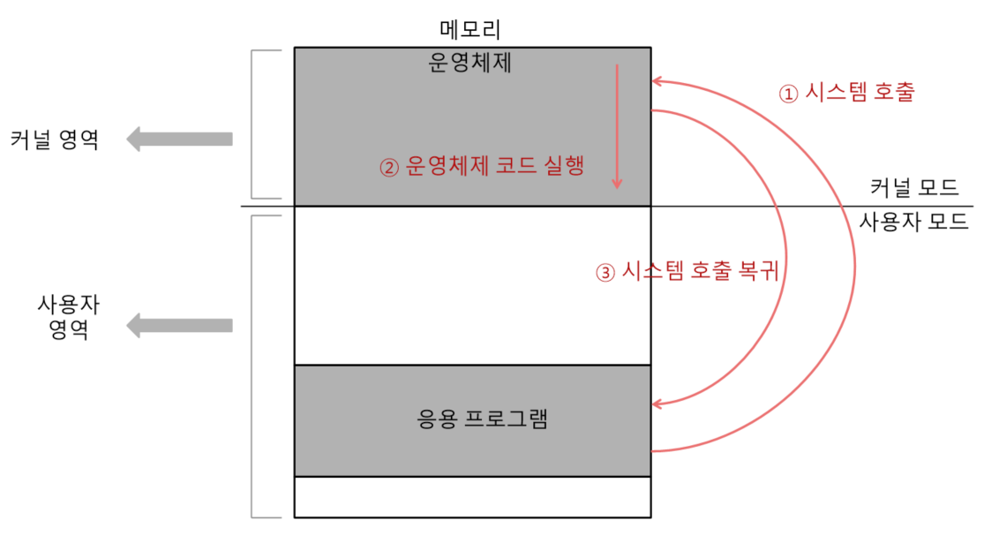

## 커널?

- 운영체제의 핵심 서비스를 담당하는 부분
  - 자원에 접근하고 조작하는 기능, 프로그램이 올바르고 안전하게 실행되게 하는 기능 등
  - 사람의 심장 or 자동차의 엔진과도 같음
  - 어떤 커널을 사용하는지에 따라 실행하고 개발하는 프로그램이 하드웨어를 이용하는 양상이 달라지고, 결과적으로 컴퓨터 전체의 성능도 달라질 수 있음
- 운영체제가 제공하는 서비스 중 커널에 포함되지 않는 서비스
  - 사용자 인터페이스(UI, User Interface) : 윈도우의 바탕화면과 같이 사용자가 컴퓨터와 상호작용할 수 있는 통로
    - 운영체제가 제공하는 사용자 인터페이스 종류
      - GUI(Graphical User Interface), 그래픽 유저 인터페이스
        - 그래픽을 기반으로 컴퓨터와 상호작용할 수 있는 인터페이스
      - CLI(Command Line Interface), 커맨드 라인 인터페이스
        - 명령어를 기반으로 컴퓨터와 상호작용할 수 있는 인터페이스

 

## 시스템콜(시스템 호출), 이중모드

### 이중모드(dual mode)
  - CPU가 명령어를 실행하는 모드를 크게 사용자 모드와 커널 모드로 구분하는 방식
    - **사용자 모드**
      - 운영체제 서비스를 제공받을 수 없는 실행모드
      - 커널 영역의 코드를 실행할 수 없는 모드
      - 일반적인 응용 프로그램은 기본적으로 사용자 모드로 실행
      - 사용자 모드로 실행되는 인반적인 응용 프로그램은 자원에 접근할 수 없음
    - **커널 모드**
      - 운영체제 서비스를 제공받을 수 있는 실행 모드
      - 커널 영역의 코드를 실행할 수 있는 모드
      - 자원에 접근하는 명령어를 비롯한 모든 명령어를 실행할 수 있음

### 시스템 콜(System Call)
- 운영체제 서비스를 제공받기 위한 요청
- 사용자 모드로 실행되는 프로그램은 시스템 콜을 통해 커널 모드로 전환해 운영체제 서비스를 제공받을 수 있음
- 일종의 → '인터럽트'
  - 소프트웨어적인 인터럽트
  - 인터럽트 → 입출력장치에 의해 발생하기도 하지만 인터럽트를 발생시키는 특정 명령어에 의해 발생하기도 함 ➡️ '소프트웨어 인터럽트'
- 시스템 호출의 작동 예 ➡️ '`한 응용 프로그램이 하드 디스크에 데이터를 저장하려 한다고 가정`'
  1. 하드 디스크에 데이터를 저장하는 시스템 호출을 발생시켜 커널 모드로 전환
  2. 운영체제 내의 '하드 디스크에 데이터를 저장하는 코드' 를 실행함으로써 하드 디스크에 접근
  3. 하드 디스크에 접근이 끝났다면 다시 사용자 모드로 복귀하여 실행을 계속해 나감

