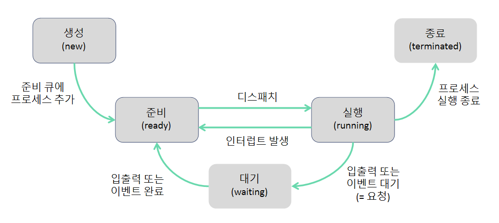

## 프로세스 상태도?

- 모든 프로세스는 CPU에 의해 생성되고 소멸하는 과정을 거침
  - 이 과정에서 프로세스는 ‘생성(new), 준비(ready), 대기(waiting), 실행(running), 종료(terminated)’ 라는 5가지 상태로 존재

- 생성(new) : 프로세스가 PCB를 가지고 있지만 OS로 부터 승인(admin) 받기 전
- 준비(ready) : OS로 부터 승인받은 후 준비 큐에서 CPU 할당을 기다림
- 실행(running) : 프로세스가 CPU를 할당받아 실행함
- 대기(waiting) : 프로세스가 입출력이나 이벤트 발생을 기다려야 해서 CPU 사용을 멈추고 기다림
- 종료(terminated) : 프로세스 실행을 종료함

 

- 프로세스는 한 상태에서 → 다른 상태로 다음과 같이 변화
  - 생성 → 준비
    - 생성 상태의 프로세스가 OS로 부터 승인을 받아, 준비 상태의 프로세스가 모여 있는 자료구조인 준비 큐(ready quere)에 추가됨
  - 준비 → 실행
    - 준비 큐에 있는 프로세스 중 우선순위가 높은 프로세스가 디스패치(dispatch)되어 실행됨
  - 실행 → 준비
    - CPU 독점을 방지하기 위해 타임아웃(timeout)되어 준비 상태로 변경됨
  - 실행 → 대기
    - 입출력 또는 이벤트 때문에 대기 상태로 변경
  - 대기 → 준비
    - 입출력 또는 이벤트가 완료되어 준비 상태로 변경
  - 실행 → 종료
    - 실행 중인 프로세스가 정상적으로 끝나서 종료 상태로 변경

---
<출처 : 기술면접대비 CS전공 핵심요약집 https://www.yes24.com/Product/Goods/121769526>
