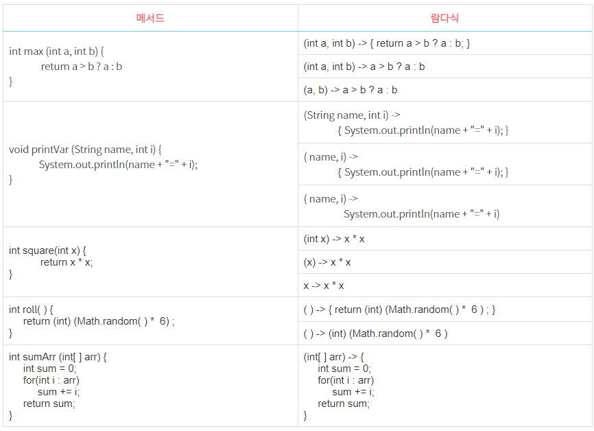

## 람다식(Lambda Expression)

- 메서드를 하나의 '식(Expression)' 으로 표현한 것
- 함수를 간략하면서도 명확한 식으로 표현할 수 있게 해줌 
- 메서드 
  - 람다식으로 표현 → 메서드의 이름과 반환값이 없어짐
    - '익명함수(aninymous funtion)' 이라고도 함
    
 

[람다식 예]

- 그림 중 오른쪽이 '람다식'

 

- 반환 타입과 이름을 지움
- " **->** " :  화살표를 추가 

---
### 함수와 메서드의 차이
 

- 근본적으로 동일
  - 함수 ➡️ 일반적 용어
  - 메서드 ➡️ 객체지향개념 용어
- 함수 : 클래스에 독립적 
- 메서드 : 클래스에 종속적
  - 클래스 안에 있음

---
### 람다식 작성하기
 

1️⃣ 메서드에서 이름과 반환타입을 제거, 매개변수 선언부와 몸통{ } 사이에 '-> ' 를 추가

2️⃣ 반환값이 있는 메서드의 경우, 식이나 값만 적고 return문 생략 가능(끝에 ' ; ' 안 붙임)

3️⃣ 매개변수의 타입이 추론 가능하면 생략가능(대부분의 경우 생략가능)

---
### 람다식 작성하기 - 주의사항
 

1️⃣ 매개변수가 하나인 경우, '괄호( )' 생략가능(타입이 없을 때만)

2️⃣ 블록 안이 문장이 하나뿐일 때, '괄호{ }' 생략가능(끝에 ' ; ' 안 붙임)

---
### 아래 표는 메서드를 람다식으로 변환해 보여줌

